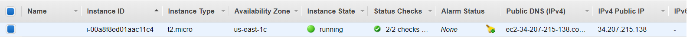
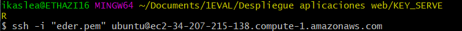
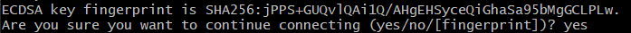
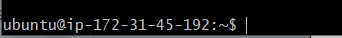

Una vez tengamos nuestra cuenta en AWS y hayamos creado nuestra máquina virtual, procederemos a conectarnos via SSH desde nuestra terminal.Para ello , abriremos la consola desde el directorio donde tengamos la clave que hemos descargado anteriormente.

1. **Esta es nuestra máquina virtual:**

    *Aquí podremos ver el estado del servidor,si está activo y también podremos tanto iniciarlo como pararlo en el apartado  **Actions**.*

2. **Conectarse via SSH:**
*Abrimos la consola donde tenemos guardada la clave de usuario.Los primero que haremos es darle permisos a la clave con la que nos conectaremos.*

*Una vez tengamos los permisos , podremos ejecutar el siguiente comando para conectarnos via SSH:*

*Nos saldrá una advertencia de si estamos seguros de que nos queremos conectar, escribimos **"yes"***.

*Finalmente, podemos ver que nos hemos conectado correctamente y podemos empezar a instalar los paquetes necesarios.*

