1. *Una vez estemos conectados al servidor mediante la máquina virtual , lo primero que tendremos que hacer , es un **sudo apt-get update**, para tener actualizada la lista de paquetes para su posterior instalación.*
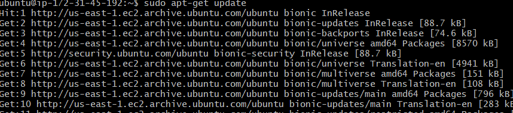

2. *Instalamos **Apache2***:
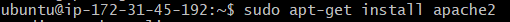

3. *Instalamos **MySQL***:
*Para instalar MySQL , ejecutamos el siguiente comando(Recordad siempre hacer un update antes de instalar algo)*

*Ahora procederemos con el siguiente comando para configurar nuestro MySQL*

*En primer lugar,nos preguntará si queremos habilitar un plugin para medir la "dureza" de la contraseña,le diremos que si.Ahora tendremos la opción de asignar el grado de dureza de la contraseña, en nuestro caso la pondremos en 'media'*.
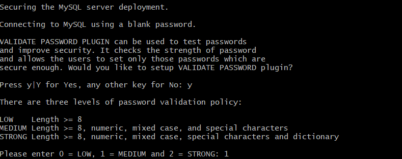
*El siguiente paso , será asignarle una contraseña al ROOT:*
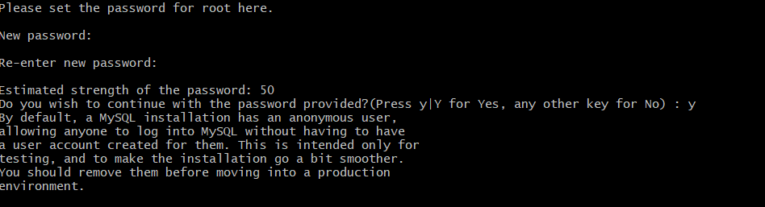
*Deshabilitamos los usuarios anonimos:*

*Desactivamos el login remoto del ROOT:*
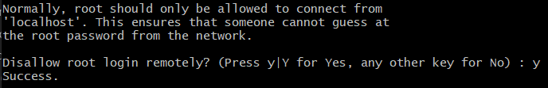
*Desactivamos los tests databases:*
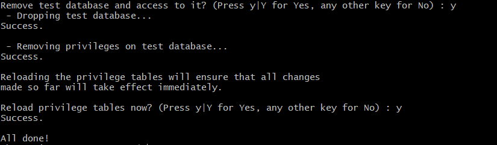
*Y por ultimo, recargamos los privilegios de las tablas:*
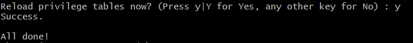

4. *Instalamos **PHPmyadmin***:
*Ejecutamos el siguiente comando , y nos preguntará si queremos continuar, pulsamos si:*
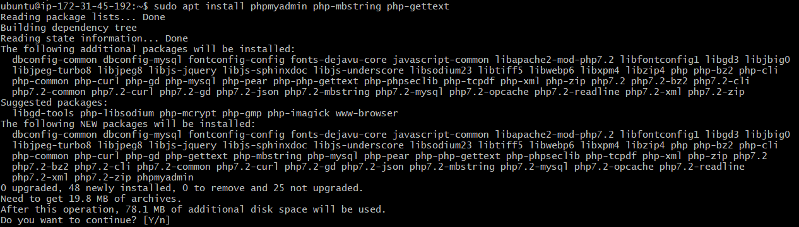
*Se abrirá una ventana emergente donde nos preguntará en que tipo de servidor queremos que se instale el PHPmyAdmin , seleccionamos Apache2:*
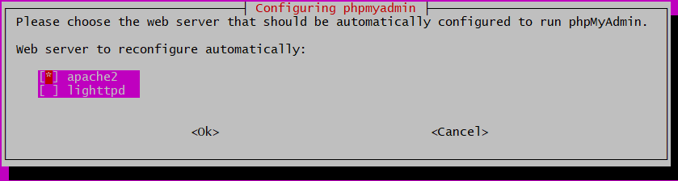
*Al pulsar siguiente , nos preguntará si queremos configurar el phpmyadmin con dbconfig-common , le decimos que si:*
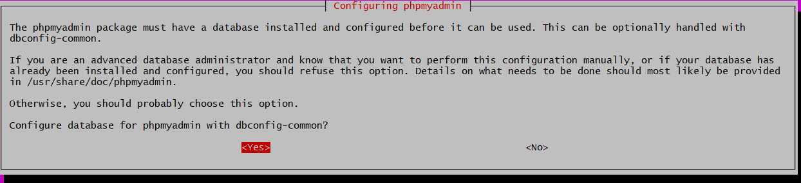
*Por ultimo , cambiamos el nombre de usuario a root@localhost y asignamos una contaseña:*
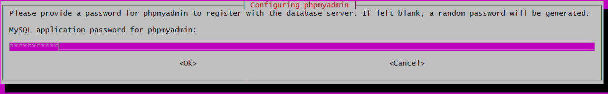