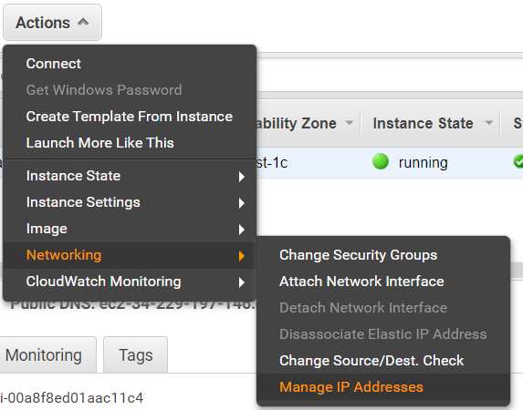
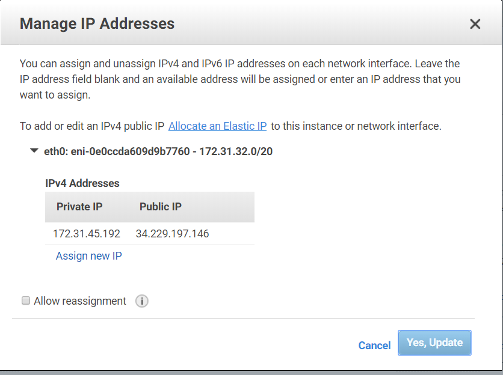
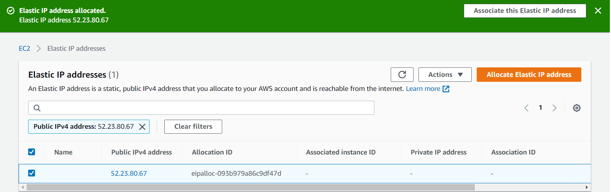
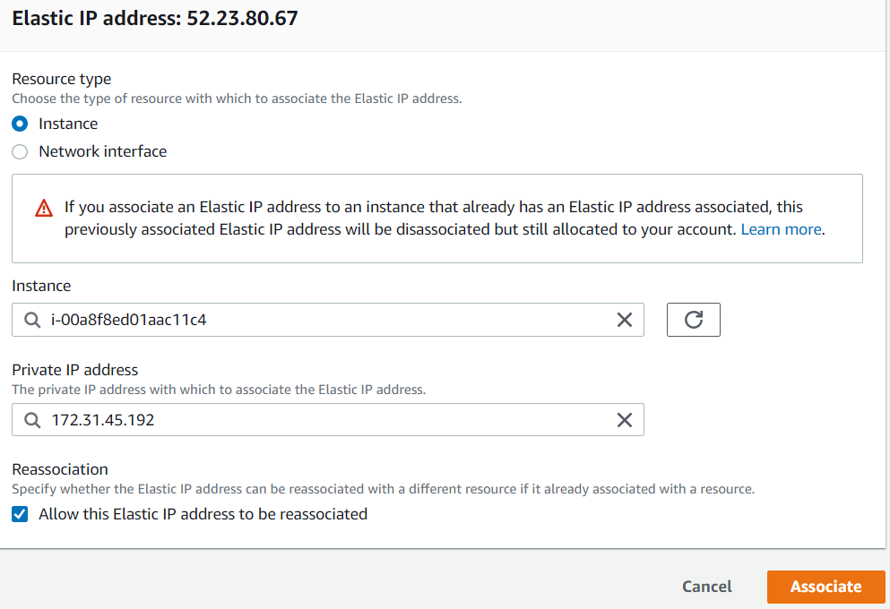

**TAREA 2: Solventar problemas de direccionamiento**
*Para asignar una IP estática , tendremos que acceder desde el menú **'actions/networking/manage Ip Addresses'***

*Se nos abrirá una ventana donde podremos ver nuestra IP pública y privada.Seleccionamos , **allocate an static IP***

*Utilizaremos la IP que ya nos salía asignada para ponerla como estática. Arriba a mano derecha clickamos en  **asociar esta IP elastica***

*Se nos abrirá otra ventana donde podremos terminar de configurar la IP elástica, utilizando una IP privada para ello.Insertamos la instancia, la IP privada elástica y marcamos la casilla **'Allow this elastic IP address to be reasociated'***.

