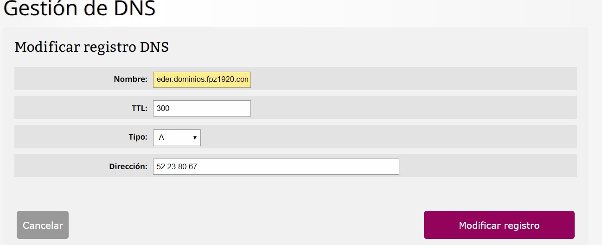
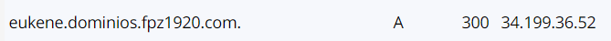

**TAREA 3: Gestión de DNS**
*Una vez accedemos a la gestion de servicios,entramos en el apartado de **gestion de DNS**.Crearemos un registro nuevo de tipo A,con 300ms, añadimos nuestro nombre , y por ultimo asociamos la IP estatica que tenemos en AWS.

*De esta manera , cuando accedamos mediante HTTP con el DNS: eder.dominio.fpz1920.com , nos redirigirá a la IP estática que tenemos en los servidores de amazon.*

**TIPOS de DNS**

1. *TIPO **A***
    Es el que permite enlazar un dominio o un subdominio con una dirección IP de un servidor.
    El tipo **AAA** utiliza la IPV6.

 2. *TIPO **CNAME***   
    Solo se utilizan para los dominios o subdominios , y siempre llevan **www** por delante

 3. *TIPO **TXT***  
    Se utilizan para que los motores de busqueda como por ejemplo google , puedan buscar tu dominio.

  4. *TIPO **SRV***  
    Los registros SRV se utilizan a menudo para los protocolos XMPP, SIP o LDAP así como para el uso de Office 365.
    