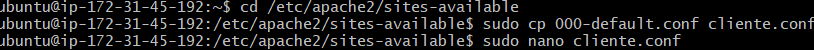
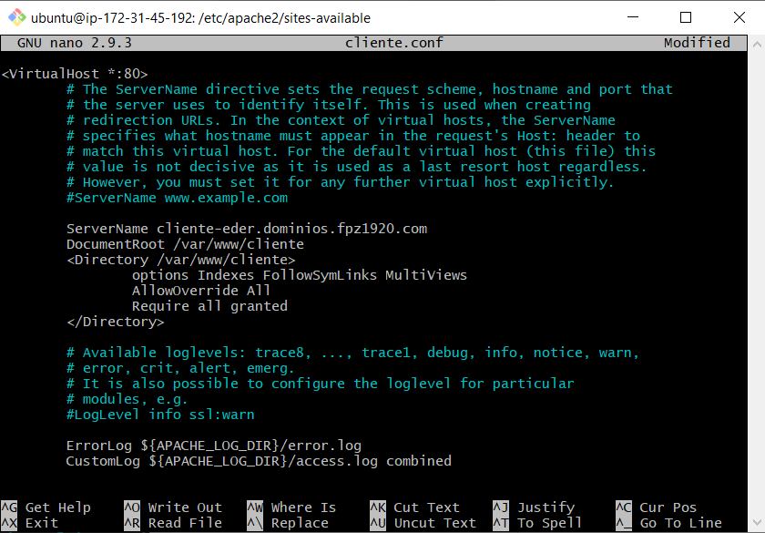
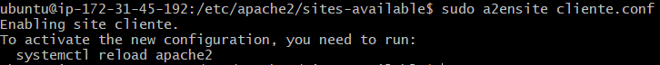
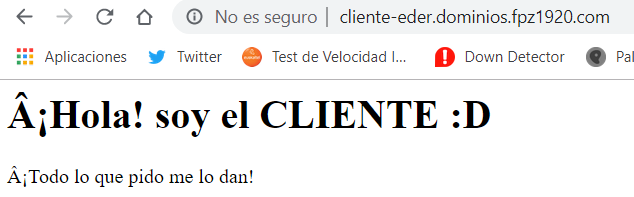
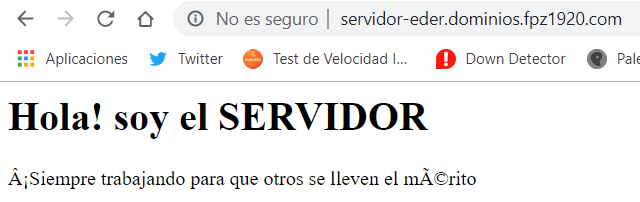

**VIRTUAL HOSTS**

1. En primer lugar, vamos a hacer una copia del archivo 000-default.conf, donde posteriormente cambiaremos las URL y los directorios de los archivos "index.html" tanto en cliente como en servidor.

Una vez dentro , cambiamos el Servername y el directorio donde se encuentra nuestro html.

Ahora deberemos habilitar la URL:

Este paso lo debemos hacer con el servidor también, cambiando el servername servidor-eder... y el directorio /var/www/servidor. Por ultimo , solo nos queda reiniciar el servidor .

Una vez hayamos completado correctamente los pasos anteriores , deberíamos poder acceder a los index.html mediante las URL que hemos asignado anteriormente.

