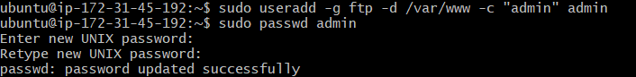

**SERVIDOR FTP**

1. Desde el launch-wizard vamos a añadir el puerto 21.

Ahora instalamos FTP en el servidor:

Creamos los usuarios cliente,servidor y admin con sus respectivas carpetas:

Con el comando nano vamos a modificar el archivo vsftpd.conf:

Reiniciamos el FTP y el apache2:

Ahora abrimos el WinSCP y desactivamos el modo pasivo:

Una vez desactivado el modo pasivo , nos podremos conectar con cualquiera de los usuarios: Admin,cliente o servidor mediante la IP elástica.

