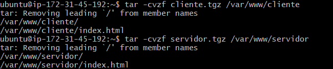

**SERVIDOR FTP**

1. En primer lugar vamos a comprimir las carpetas de clieny servidor:

Hacemos un ls para comprobar si se han comprimido correctamente:

Miramos el estado de SQL:

Creamos una base de datos con el usuario ROOT:

Hacemos una copia de la BBDD:

Por ultimo , comprobamos si se ha hecho la copia de la BBDD correctamente:
